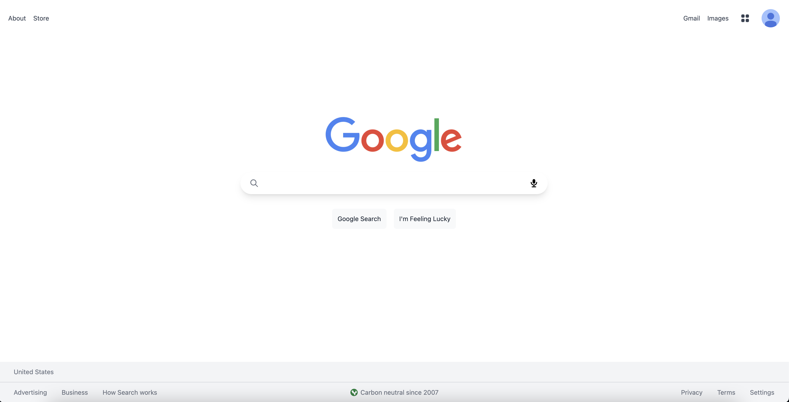

# Google Clone - ReactJS

## 📷 Screenshot

  

## 📝 Project Description

Google clone allows users to search with the Google API.

## 📚 Technologies

- [ReactJS](https://reactjs.org/)
- [NextJS](https://nextjs.org/)
- [Tailwind CSS](https://tailwindcss.com/)
- [Vercel](https://vercel.com/dashboard)
- [API: Google](https://developers.google.com/custom-search/v1/using_rest)
